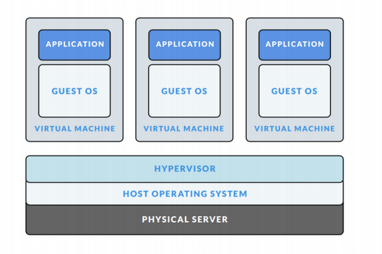
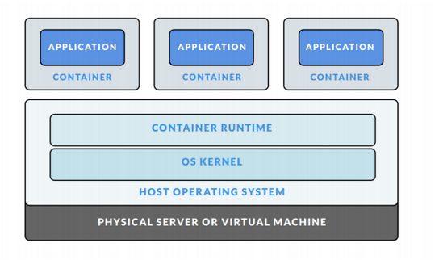
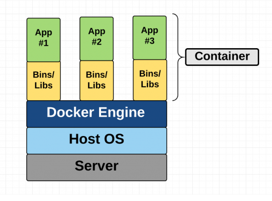
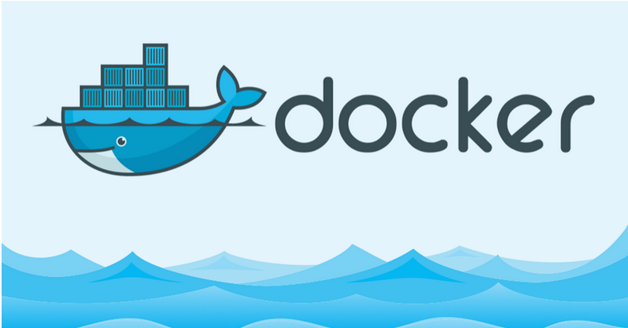
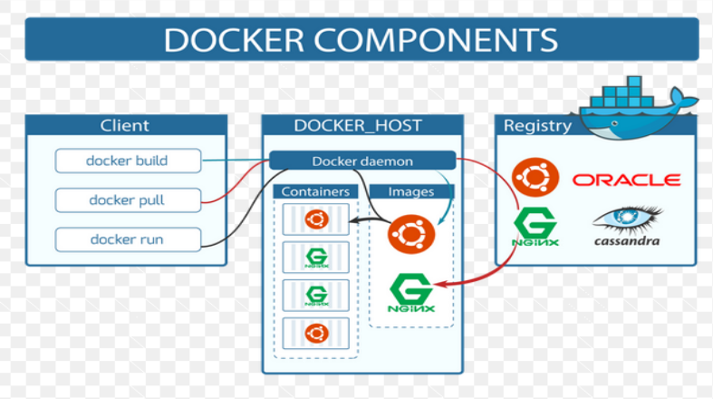

## Docker là gì ? ##

Mục lục:
	- Giới thiệu về Docker
	- Kiến trúc, các khái niệm liên quan khi tìm hiểu về Docker
	- Tổng kết
	
### 1. Giới thiệu về Docker

### 1.1. Containerlization là gì ?

- Để hiểu rõ hơn tại sao Docker được ra đời, đầu tiên mình sẽ giới thiệu về công nghệ ảo hóa `vitualization`. 

  
  
- Với công nghệ này, trên một máy chủ vật lý (host) mình có thể tạo được nhiều Vitural Machines (VMs) sử dụng một thứ gọi là “hypervisor”. Hypervisor có thể là phần cứng, phần mềm hoặc là một bản firmware nào đó có thể chạy trực tiếp trên máy thật (host machine) có chức năng cho nhiều máy ảo chạy trên nó. Host machine sẽ cung cấp cho VMs những tài nguyên như là RAM, CPU, Disk.

- Một số vấn đề nảy sinh:

	* Về tài nguyên: Khi bạn chạy máy ảo, bạn phải cung cấp "cứng" ram, cpu, disk cho máy ảo đó, bật máy ảo lên để đó không làm gì thì máy thật cũng phải phân phát tài nguyên. Ví dụ khi tạo một máy ảo ram 2GB trên máy thật ram 4GB, lúc này máy thật sẽ mất 2GB ram cho máy ảo, kể cả khi máy ảo không dùng hết 2GB ram, đó là một sự lãng phí.
	
	* Về thời gian: Việc khởi động, shutdown khá lâu, có thể lên tới vài phút.

- Ở bước tiến hóa tiếp theo, người ta sinh ra công nghệ `containerlization`

  
 
- Với công nghệ này, trên một máy chủ vật lý, ta sẽ sinh ra được nhiều máy con (giống với công nghệ ảo hóa `vitualization`), nhưng khác biệt ở chỗ là các máy con này (Guess OS) đều dùng chung kernel của máy mẹ (Host OS).

- Có thể nói là khi nào cần tài nguyên thì được cấp, cần bao nhiêu thì cấp bấy nhiêu, như vậy việc tận dụng tài nguyên đã tối ưu hơn. Điểm nổi bật nhất của `containerlization` là nó sử dụng các `container`. Vậy `container` là gì ?

### 1.2. Container là gì ?

- Các phần mềm, chương trình sẽ được `Container Engine` ( ví dụ: Docker hoặc rkt ) đóng gói thành các container.

  

- Thế Container là gì, nó là một giải pháp để chuyển giao phần mềm một cách đáng tin cậy giữa các môi trường máy tính khác nhau bằng cách:

	* Tạo ra một môi trường chứa mọi thứ mà phần mềm cần để có thể chạy được.
	
    * Không bị các yếu tố liên quan đến môi trường hệ thống làm ảnh hưởng tới, cũng như không làm ảnh hưởng tới các phần còn lại của hệ thống.

- Bạn có thể hiểu là các ứng dụng mysql, redis, nginx, php... được bỏ gọn vào một hoặc nhiều cái thùng (container), ứng dụng của bạn chạy trong những chiếc thùng đó, đã có sẵn mọi thứ cần thiết để hoạt động, không bị ảnh hưởng từ bên ngoài và cũng không gây ảnh hưởng ra ngoài.

- Các tiến trình (process) trong một container bị cô lập với các tiến trình của các container khác trong cùng hệ thống tuy nhiên tất cả các container này đều chia sẻ kernel của host OS (dùng chung host OS).

- Ưu điểm:
	
	* Linh động: Triển khai ở bất kỳ nơi đâu do sự phụ thuộc của ứng dụng vào tầng OS cũng như cơ sở hạ tầng được loại bỏ.
	
    * Nhanh: Do chia sẻ host OS nên container có thể được tạo gần như một cách tức thì.
	
	* Nhẹ: Container cũng sử dụng chung các images nên cũng không tốn nhiều disks.
	
    * Đồng nhất :Khi nhiều người cùng phát triển trong cùng một dự án sẽ không bị sự sai khác về mặt môi trường.
    
- Nhược điểm:

	* Xét về tính an toàn: Do dùng chung OS nên nếu có lỗ hổng nào đấy ở kernel của host OS thì nó sẽ ảnh hưởng tới toàn bộ container có trong host OS đấy.
	
### 1.3. Docker là gì ?

  

- Docker là một dự án mã nguồn mở được tạo bởi công ty dotCloud ( nay đổi tên là Docker) giúp tự động triển khai các ứng dụng Linux và Windows vào trong các container.

### 2. Kiến trúc, các khái niệm liên quan khi tìm hiểu về Docker:

- Docker hoạt động theo kiến trúc client-server
 
  
  
- Docker client trao đổi với Docker daemon thông qua REST API.

- Docker daemon Docker daemon (dockerd) nghe các yêu cầu từ Docker client và quản lý các đối tượng Docker như images, containers, network và volume. Một daemon cũng có thể giao tiếp với các daemon khác để quản lý các Docker services.

- Docker registries: là một kho chứa các image với hai chế độ là private và public. Docker Hub là một kho chứa các image được public bởi cộng đồng Docker.

- Docker objects, Khi bạn sử dụng Docker là lúc mà bạn tạo ra các images, containers, networks, volume và các other objects.

	* `image`: là các template read-only hướng dẫn cách tạo ra các Docker container. image được sử dụng để đóng gói ứng dụng và các thành phần phụ thuộc của ứng dụng. Image có thể được lưu trữ ở local hoặc trên một registry.
	
	* `container`: 1 Container là 1 runable instance của image. Bạn có thể create, run, stop, delete or move container sử dụng Docker API or CLI.
	
	* `services`: Service cho phép bạn mở rộng các containers thông qua Docker daemons, chúng làm việc với nhau như 1 nhóm (swarm) với machine manager và workers. Mỗi một member của swarm là 1 daemon Docker giao tiếp với nhau bằng cách sử dụng Docker API. Theo mặc định thì service được cân bằng tải trên các nodes.
	
	* `volume`: volume được thiết kể để lưu trữ các dữ liệu độc lập với vòng đời của container. 
	
	* `network`: cũng giống như VMs, mỗi container cũng sẽ có 1 network riêng để quản lí IP, DNS, route table.

### 3. Tổng kết

- Bài viết này là những ghi chép cơ bản của mình về lịch sử hình thành, kiến trúc hoạt động và các thành phần cơ bản khi tìm hiểu về Docker. Trong bài viết tiếp theo, mình sẽ trình bày chi tiết về **Docker daemons (Docker-server)** - thành phần chính trong kiến trúc của Docker.

- Link tham khảo:

	* https://viblo.asia/p/docker-chua-biet-gi-den-biet-dung-phan-1-lich-su-ByEZkWrEZQ0
	
	* https://github.com/hocchudong/ghichep-docker/blob/master/docs/docker-coban/ghichep-docker.md
