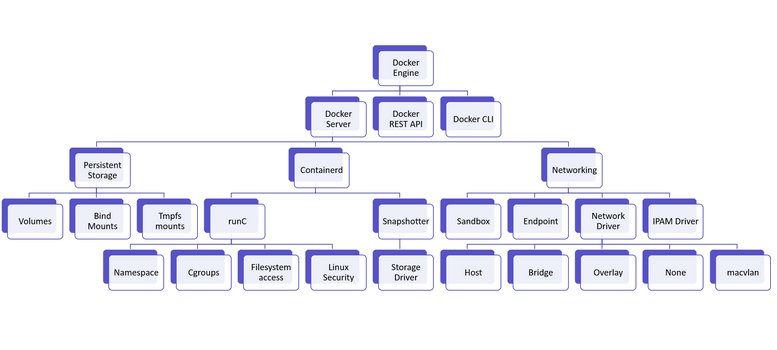
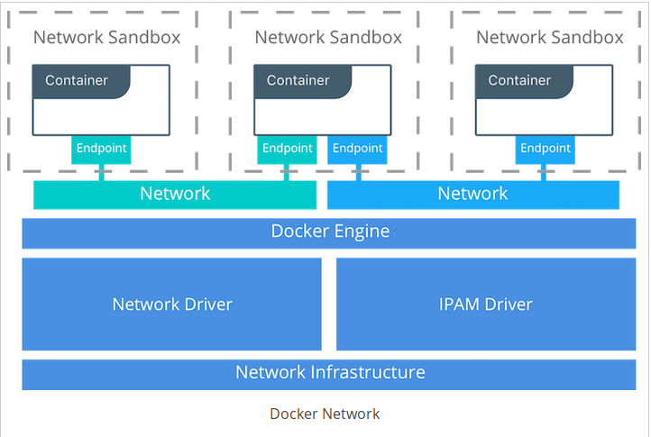

## Tìm hiểu về Docker server.

### 1. Giới thiệu:

- Docker server (dockerd/daemond). Là thành phần chính trong kiến trúc của Docker. Nó chịu trách nhiệm quản lý images, containers và các thành phần của containers: networks, volumes. Trong bài viết này, mình sẽ giới thiệu về các thành phần, nhiệm vụ của từng thành phần trong `Docker server`.
	
### 2. Chức năng, nhiệm vụ của từng thành phần trong Docker-server

  
  
### 2.1. Containerd

- Trái tim của hệ thống container là containerd. Nó là container runtime cho docker engine sử dụng để tạo và quản lý các container. Nó trừu tượng hóa các lời gọi tới chức năng cụ thể của system hoặc OS để chạy container trên windows, solaris và OS khác. Phạm vi của containerd bao gồm các thứ sau:

	* Create, start, stop, pause, resume, signal, delete một container
    * Chức năng cho overlay, aufs và copy-on-write file system khác cho các container
    * Build, push, pull images và quản lý các image
    * Persistent container logs

### 2.2. Persistent storage**

- Persistent storage cung cấp khả năng lưu trữ các dữ liệu của container 1 cách bền bỉ. Có nghĩa là kể cả khi ta xóa 1 container thì dữ liệu của container đó vẫn sẽ không bị mất đi.

- Persistent storage cung cấp 3 options: volumes, bind mounts, tmpfs mounts:
	
	* `Volumes`: Docker Server đảm nhiệm việc duy trì các volume và chúng được quản lý bằng API hoặc Client. Các volume có thể được chia sẻ giữa nhiều container và hoạt động trên cả linux, windows, thâm chí cả remote hosts hoặc cloud providers. Các volume được tạo ra trên host nhưng được quản lý bởi docker và tuổi thọ của nó độc lập với vòng đời của container. Một volume có thể được gắn cho nhiều container trên các remote host hoặc cloud provider bằng cách sử dụng volume driver.
	
	* `Bind Mounts`: Bạn có thể gắn một file hoặc thư mục từ host machine vào trong docker container bằng cách sử dụng bind mounts. Chúng bị giới hạn về chức năng so với volumes và sử dụng đường dẫn file hoàn chỉnh của host system. Các Volume được ưu tiên để bind mounts cho các ứng dụng mới.
	
	* `tmpfs Mounts`: Cách thức lưu trữ này có thể được sử dụng để lưu trữ dữ liệu tạm thời vì dữ liệu không được lưu trên ổ cứng mà được lưu trên vùng lưu trữ tạm thời của host machine ( memory ).
	

### 2.3. Networking

  
  
- `Sanbox`: Chứa các cấu hình mạng của 1 container. Bao gồm quản lý network interface, route tables và các thiết lập DNS. Một Sandbox có thể được coi là một namespace network và có thể chứa nhiều endpoit từ nhiều mạng.  
 
- `Endpoint` - Là điểm kết nối một Sandbox tới một mạng.
 
- `Network Driver` được sử dụng bởi docker engine để kết nối vào hạ tầng network thực tế. Có hai loại network driver là native và remote. Native driver có mặt bên trong Docker Engine và các Remote driver là các network drivers được tạo ra bởi cộng đồng và các nhà cung cấp. Được sử dụng để tích hợp vào các phần mềm hoặc phần cứng đang hoạt động.
 
- `Native driver` có các loại sau:
	
	* Host: Containers sẽ dùng mạng trực tiếp của máy host. Network configuration bên trong container đồng nhất với host.
	
    * Bridge: Container tạo ra một linux bridge. Các container sẽ nói chuyện với nhau thông qua bridge này.
	
    * Overlay: Tạo ra một overlay network để hỗ trợ kết nối giữa các container trên nhiều host khác nhau, trong môi trường cluster.

    * None: Tạo ra các network và namespace nhưng không cung cấp cho container giao diện. Các container đó hoàn toàn bị cô lập.
	
- `IPAM Driver`: Quản lý việc cấp phát địa chỉ IP cho các containers
      
### 3. Tổng kết:

- Trong các phần tiếp theo, mình sẽ đi vào chi tiết về từng thành phần trong Docker-server và các công nghệ nền tảng được sử dụng trong Docker.

- Link tham khảo: http://www.studytrails.com/devops/docker-architecture-engine-containerd-runc/
	