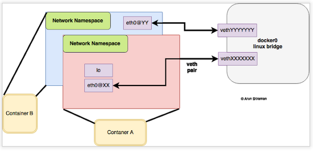

## Namespaces trong Docker

### 1. Giới thiệu

- Namespaces là một tính năng của Linux Kernel để cô lập các tài nguyên hệ thống như một tập hợp tiến trình(process) chỉ thấy một tập hợp các tài nguyên tương ứng. Linux Namespaces là một công nghệ cốt yếu phía sau hầu hết các container runtime hiện nay. 

- Các loại namespaces trong linux được sử dụng trong Docker:
	
	* `PID` - cô lập vùng số cấp cho ID của tiến trình
	
	* `IPC` - cô lập tài nguyên giao tiếp liên tiến trình(IPC)
	
	* `Network` - cô lập giao diện mạng
	
	* `Mount` - cô lập các filesystem mount point
	
	* `UTS` - cô lập hostname và domainname

	* `User` - cô lập về UID/GID
	
### 2. Các loại namespaces

### 2.1. PID namespace

### 2.2. IPC namespace

### 2.3. Network namespace. 

- Khi start 1 container với lệnh `docker run`, Docker sẽ tạo ra các namespaces và cgroups để quản lí container. 

- Namespace cung cấp khả năng cô lập cơ bản đầu tiên đó là: các tiến trình chạy trong 1 container sẽ không nhìn thấy và ảnh hưởng không đáng kể tới các tiến trình ở trên các container khác và tiến trình ở trên host. Ở trong 1 container, ta thực hiện check bằng câu lệnh `ps -ef`, sẽ chỉ list ra được các process của container đó, và không thể nhìn thấy được các process của host hay của các container khác.

- Mỗi 1 container sẽ có 1 ngăn xếp mạng riêng của mình, nghĩa là mỗi 1 container sẽ có 1 IP, interface, route table riêng của mình, và nó sẽ không có quyền truy cập vào sockets hay interface của các container khác.

- Ở đây mình nói về network namepsace, mỗi 1 container khi được khởi tạo sẽ sử dụng 1 network namespace riêng.

  

- Bản chất, khi 1 container được khởi tạo, nó là 1 tiến trình được quản lí trên host và có 1 PID riêng.

- Ví dụ, mình thực hiện start 2 container 

  ```
  docker run -d --name test_mem nginx_image
  
  docker run -d nginx_image
  
  ```
 
- List các container đang chạy:
  
  ```
  docker ps
  CONTAINER ID        IMAGE               COMMAND                  CREATED             STATUS              PORTS               NAMES
  440904bfa41a        nginx_image         "nginx -g 'daemon off"   About an hour ago   Up About an hour    80/tcp              test_mem
  b970c1957f46        nginx_image         "nginx -g 'daemon off"   About an hour ago   Up 2 seconds        80/tcp              high_stonebraker

  ```
  
- Check PID của container bạn có thể dùng lệnh sau:

  ```
  docker inspect -f '{{ .State.Pid }}'  tên container/container ID
  
  hoặc có thể dùng lệnh sau ( Docker sử dụng container-runtime là runC ): docker-runc list | grep container ID
  
  docker-runc list
  ID                                                                 PID         STATUS      BUNDLE                                                                                       CREATED
  440904bfa41a74090d335d03a64fa439443d2d234993f3457f0a11128b999261   5746        running     /run/docker/libcontainerd/440904bfa41a74090d335d03a64fa439443d2d234993f3457f0a11128b999261   2019-03-05T07:37:03.633443695Z
  b970c1957f464a6d3defd624985ad43b3a4d7cae4708e945ad5d57f46c8eb75a   6797        running     /run/docker/libcontainerd/b970c1957f464a6d3defd624985ad43b3a4d7cae4708e945ad5d57f46c8eb75a   2019-03-05T08:57:07.611953673Z
  ```
- các namespaces được sử dụng bởi 1 process sẽ được lưu ở: `/proc/{PID}/ns/`. Cụ thể ở ví dụ này, process quản lí 2 container trên:

  ```
  ls -lia /proc/5746/ns/
  30276 dr-x--x--x 2 root root 0 Mar  5 07:37 .
  30054 dr-xr-xr-x 9 root root 0 Mar  5 07:37 ..
  32309 lrwxrwxrwx 1 root root 0 Mar  5 08:38 ipc -> ipc:[4026532675]
  32312 lrwxrwxrwx 1 root root 0 Mar  5 08:38 mnt -> mnt:[4026532673]
  30277 lrwxrwxrwx 1 root root 0 Mar  5 07:37 net -> net:[4026532678]
  32310 lrwxrwxrwx 1 root root 0 Mar  5 08:38 pid -> pid:[4026532676]
  32311 lrwxrwxrwx 1 root root 0 Mar  5 08:38 user -> user:[4026531837]
  32308 lrwxrwxrwx 1 root root 0 Mar  5 08:38 uts -> uts:[4026532674]
  
  
  ls -lia /proc/6797/ns/
  33770 dr-x--x--x 2 root root 0 Mar  5 08:57 .
  33570 dr-xr-xr-x 9 root root 0 Mar  5 08:57 ..
  33991 lrwxrwxrwx 1 root root 0 Mar  5 08:59 ipc -> ipc:[4026532193]
  33994 lrwxrwxrwx 1 root root 0 Mar  5 08:59 mnt -> mnt:[4026532191]
  33771 lrwxrwxrwx 1 root root 0 Mar  5 08:57 net -> net:[4026532196]
  33992 lrwxrwxrwx 1 root root 0 Mar  5 08:59 pid -> pid:[4026532194]
  33993 lrwxrwxrwx 1 root root 0 Mar  5 08:59 user -> user:[4026531837]
  33990 lrwxrwxrwx 1 root root 0 Mar  5 08:59 uts -> uts:[4026532192]
  ```

- Như hình vẽ mô tả về network namespace ở trên, ta thấy mỗi 1 container sẽ có 1 interface riêng, ta thực hiện kiểm tra lí thuyết ở trên:
  
- Ta thực hiện truy cập vào network namespace của container có PID là 5746

  ```
  nsenter --target 5746 --net
  ```
  
  ```
  ip a 
  1: lo: <LOOPBACK,UP,LOWER_UP> mtu 65536 qdisc noqueue state UNKNOWN group default 
    link/loopback 00:00:00:00:00:00 brd 00:00:00:00:00:00
    inet 127.0.0.1/8 scope host lo
       valid_lft forever preferred_lft forever
    inet6 ::1/128 scope host 
       valid_lft forever preferred_lft forever
  22: eth0: <BROADCAST,MULTICAST,UP,LOWER_UP> mtu 1500 qdisc noqueue state UP group default 
    link/ether 02:42:ac:11:00:05 brd ff:ff:ff:ff:ff:ff
    inet 172.17.0.5/16 scope global eth0
       valid_lft forever preferred_lft forever
    inet6 fe80::42:acff:fe11:5/64 scope link 
       valid_lft forever preferred_lft forever
  ```

- Thoát khỏi network namespace của container trên.
  
  ```
  exit
  ```
- Ta thực hiện truy cập vào network namespace của container có PID là 6797

  ```
  nsenter --target 6797 --net
  ```

  ```
  ip a 
  1: lo: <LOOPBACK,UP,LOWER_UP> mtu 65536 qdisc noqueue state UNKNOWN group default 
    link/loopback 00:00:00:00:00:00 brd 00:00:00:00:00:00
    inet 127.0.0.1/8 scope host lo
       valid_lft forever preferred_lft forever
    inet6 ::1/128 scope host 
       valid_lft forever preferred_lft forever
  24: eth0: <BROADCAST,MULTICAST,UP,LOWER_UP> mtu 1500 qdisc noqueue state UP group default 
    link/ether 02:42:ac:11:00:05 brd ff:ff:ff:ff:ff:ff
    inet 172.17.0.1/16 scope global eth0
       valid_lft forever preferred_lft forever
    inet6 fe80::42:acff:fe11:5/64 scope link 
       valid_lft forever preferred_lft forever
  ```
  
- Tháo khỏi network namespace của container trên.
  
  ```
  exit
  ```

- Check network trên host, ta thấy linux Default bridge docker0, và 2 veth để kết nối 2 container vào docker0
  
  ```
  ip a
  4: docker0: <BROADCAST,MULTICAST,UP,LOWER_UP> mtu 1500 qdisc noqueue state UP group default 
    link/ether 02:42:06:8a:80:d5 brd ff:ff:ff:ff:ff:ff
    inet 172.17.42.1/16 scope global docker0
       valid_lft forever preferred_lft forever
    inet6 fe80::42:6ff:fe8a:80d5/64 scope link 
       valid_lft forever preferred_lft forever
  5: br-c6c02dc75a39: <NO-CARRIER,BROADCAST,MULTICAST,UP> mtu 1500 qdisc noqueue state DOWN group default 
    link/ether 02:42:e1:01:0d:22 brd ff:ff:ff:ff:ff:ff
    inet 192.168.23.1/24 scope global br-c6c02dc75a39
       valid_lft forever preferred_lft forever
    inet6 fe80::42:e1ff:fe01:d22/64 scope link 
       valid_lft forever preferred_lft forever
  23: vethc6b00a2: <BROADCAST,MULTICAST,UP,LOWER_UP> mtu 1500 qdisc noqueue master docker0 state UP group default 
    link/ether 06:02:81:79:db:a8 brd ff:ff:ff:ff:ff:ff
    inet6 fe80::402:81ff:fe79:dba8/64 scope link 
       valid_lft forever preferred_lft forever
  25: vethe9eacc5: <BROADCAST,MULTICAST,UP,LOWER_UP> mtu 1500 qdisc noqueue master docker0 state UP group default 
    link/ether 62:fd:cf:0c:58:d5 brd ff:ff:ff:ff:ff:ff
    inet6 fe80::60fd:cfff:fe0c:58d5/64 scope link 
       valid_lft forever preferred_lft forever
  ```

### 2.4. Mnt namespace (Mount namespace)

- Ta vẫn sử dụng lệnh `nsenter` để thực hiện check Mnt namespace của mỗi 1 container.

  ```
  nsenter --target 5746 --mount
  ```
- Tạo thử 1 file thangtq.txt ở trong mnt namespace này:
  
  ```
  touch thangtq.txt
  
  ls -lia .
  total 72
    2 drwxr-xr-x  44 root root 4096 Mar  5 09:28 .
    2 drwxr-xr-x  44 root root 4096 Mar  5 09:28 ..
  125 -rwxr-xr-x   1 root root    0 Mar  5 07:37 .dockerenv
  134 drwxr-xr-x   2 root root 4096 Jan 22 13:48 bin
  131 drwxr-xr-x   2 root root 4096 Apr 10  2014 boot
  30221 drwxr-xr-x   5 root root  360 Mar  5 07:37 dev
   11 drwxr-xr-x  78 root root 4096 Mar  5 07:37 etc
  135 drwxr-xr-x   2 root root 4096 Apr 10  2014 home
   37 drwxr-xr-x  13 root root 4096 Feb 18 09:23 lib
   35 drwxr-xr-x   2 root root 4096 Jan 22 13:47 lib64
  133 drwxr-xr-x   2 root root 4096 Jan 22 13:47 media
  128 drwxr-xr-x   2 root root 4096 Apr 10  2014 mnt
  132 drwxr-xr-x   2 root root 4096 Jan 22 13:47 opt
    1 dr-xr-xr-x 111 root root    0 Mar  5 07:37 proc
  129 drwx------   2 root root 4096 Mar  5 09:27 root
  103 drwxr-xr-x   8 root root 4096 Mar  5 07:37 run
  127 drwxr-xr-x   2 root root 4096 Jan 22 22:46 sbin
  130 drwxr-xr-x   2 root root 4096 Jan 22 13:47 srv
    1 dr-xr-xr-x  13 root root    0 Mar  5 07:37 sys
  13564 -rw-r--r--   1 root root    0 Mar  5 09:28 thangtq.txt
  
  
  ```
- Tháo khỏi mnt namespace trên, và truy cập vào mnt namespace của container có PID: 6797
  
  ```
  exit
  nsenter --target 6797 --mount
  ls -lia .
  2 drwxr-xr-x  44 root root 4096 Mar  5 09:09 .
  2 drwxr-xr-x  44 root root 4096 Mar  5 09:09 ..
  166 -rwxr-xr-x   1 root root    0 Mar  5 07:36 .dockerenv
  124 drwxr-xr-x   2 root root 4096 Jan 22 13:48 bin
  170 drwxr-xr-x   2 root root 4096 Apr 10  2014 boot
  33728 drwxr-xr-x   5 root root  360 Mar  5 08:57 dev
  11 drwxr-xr-x  78 root root 4096 Mar  5 07:36 etc
  173 drwxr-xr-x   2 root root 4096 Apr 10  2014 home
   37 drwxr-xr-x  13 root root 4096 Feb 18 09:23 lib
   35 drwxr-xr-x   2 root root 4096 Jan 22 13:47 lib64
  172 drwxr-xr-x   2 root root 4096 Jan 22 13:47 media
  168 drwxr-xr-x   2 root root 4096 Apr 10  2014 mnt
  171 drwxr-xr-x   2 root root 4096 Jan 22 13:47 opt
    1 dr-xr-xr-x 111 root root    0 Mar  5 08:57 proc
  133 drwx------   2 root root 4096 Mar  5 09:09 root
  103 drwxr-xr-x   8 root root 4096 Mar  5 08:57 run
  154 drwxr-xr-x   2 root root 4096 Jan 22 22:46 sbin
  169 drwxr-xr-x   2 root root 4096 Jan 22 13:47 srv
    1 dr-xr-xr-x  13 root root    0 Mar  5 08:57 sys
  167 drwxrwxrwt   2 root root 4096 Feb 18 09:23 tmp
   29 drwxr-xr-x  16 root root 4096 Feb 18 09:23 usr
   24 drwxr-xr-x  17 root root 4096 Mar  5 07:36 var
  ```
- -> Ta thấy trên mnt namespace của PID 6797 sẽ không nhìn thấy file `thangtq.txt`

- Ở trên docker host, ta sẽ thấy file thangtq.txt đang được nằm trên mnt namespace nào:

  ```
  updatedb
  root@vagrant-ubuntu-trusty-64:~# locate thangtq.txt
  /var/lib/docker/aufs/diff/5c3a0250216c2b469865e4a1854437c2ede8b5febcdf29274bea81c5da299092/thangtq.txt
  /var/lib/docker/aufs/mnt/5c3a0250216c2b469865e4a1854437c2ede8b5febcdf29274bea81c5da299092/thangtq.txt
  ```
- *Bạn có thể truy cập trực tiếp vào 1 container mà không cần sử dụng docker:*

  ```
  root@vagrant-ubuntu-trusty-64:~# nsenter --target 6797 --mount --uts --ipc --net --pid
  root@b970c1957f46:/#
  ```
### 4. Tham khảo

- https://platform9.com/blog/container-namespaces-deep-dive-container-networking/

- https://docs.docker.com/engine/security/security
  
  