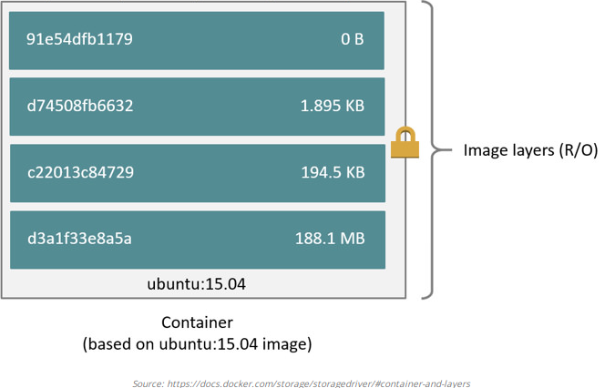
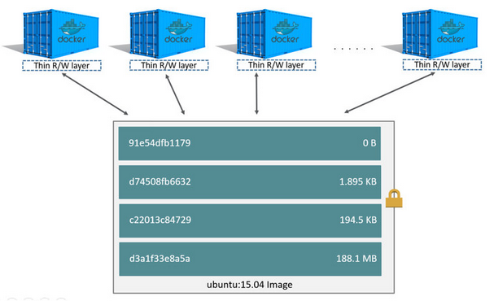

## Tìm hiểu về image 

**Mục lục**

	1. Image là gì ?
	2. Cách tạo 1 image như nào
	3. Kiến trúc của image

### 1. Image là gì

- Image là template để tạo container. Đơn giản, bạn có thể pull các image có sẵn được publish từ cộng đồng Docker Hub để sử dụng. Ví dụ, pull image ubuntu:14.04 từ Docker Hub

  ```
  docker pull ubuntu:14.04
  ```

### 2. Cách tạo 1 image

- Bản chất, các image ở trên Docker Hub này được tạo từ Dockerfile và được đóng gói đẩy lên registry( Docker Hub - kho lưu trữ các image). Bạn cũng có thể tự viết Dockerfile để build các image riêng, để đáp ứng cho các mục đích riêng của mình.

- Ngoài ra các image cũng có thể được tạo từ chính các container running.

- Để các bạn có thể hiểu được rõ hơn về bản chất của 1 image là như nào. Ở đây mình sẽ thực hiện 2 cách để build 1 image: từ Dockerfile và chính container 

### 2.1. Tạo 1 image từ Dockerfile

- Mình có 1 Dockerfile cơ bản (Dockerfile là 1 tập các lệnh để build image, chi tiết về Dockerfile sẽ nói ở bài sau), lưu ở /root/images-nginx để tự build image nginx riêng:

  ```
  FROM ubuntu:14.04

  ENV DEBIAN_FRONTEND noninteractive

  RUN echo "exit 0" > /usr/sbin/policy-rc.d

  RUN apt-get update \
    && apt-get install -y nginx --no-install-recommends apt-utils \
    && apt-get clean \
    && rm -rf /tmp/* /var/tmp/*

  # Define mountable directories.
  VOLUME ["/etc/nginx/sites-enabled", "/etc/nginx/certs", "/etc/nginx/conf.d", "/var/log/nginx", "/var/www/html"]

  # Define working directory.
  WORKDIR /etc/nginx

  # Expose ports.
  EXPOSE 80

  # Define default command.
  CMD ["nginx", "-g", "daemon off;"]  
  ```

- Build images từ dockerfile trên:
  
  ```
  docker build -t nginx_image1 .
  ```
  
- List các image đang có trên host:

  ```
  docker images
  REPOSITORY           TAG                 IMAGE ID            CREATED             SIZE
  nginx_image1         latest              b5c43eeb15eb        58 minutes ago      218.6 MB
  ubuntu               14.04               5dbc3f318ea5        6 weeks ago         188.1 MB
  ```
  
- Khởi tạo 1 container từ image **nginx_image1** trên
  
  ```
  docker run -d --name test1 nginx_image1
  ```
  
- List container vừa khởi tạo ở trên
   
  ```
  docker ps
  CONTAINER ID        IMAGE               COMMAND                  CREATED             STATUS              PORTS               NAMES
  eb151ce54432        nginx_image1        "nginx -g 'daemon off"   2 seconds ago       Up 1 seconds        80/tcp              test1
  ```

### 2.2 Tạo image từ container

- Ở đây, mình sẽ thực hiện tạo thử 1 image từ container

- Truy cập vào container `test1` trên và thực hiện cài `wget`
  
  ```
  apt install wget
  ```

- Tạo image mới từ container trên bằng lệnh `docker commit containerID tên_image_mới`
  
  ```
  docker commit eb151ce54432 nginx_image2
  ```

- Check image vừa tạo:

  ```
  docker images 
  REPOSITORY           TAG                 IMAGE ID            CREATED             SIZE
  nginx_image2         latest              12fa04bf95f3        3 seconds ago       224.8 MB
  nginx_image1         latest              b5c43eeb15eb        About an hour ago   218.6 MB
  ubuntu               14.04               5dbc3f318ea5        6 weeks ago         188.1 MB
  ```

- Tạo thử container mới từ image vừa tạo ở trên:

  ```
  docker run -d --name test2 nginx_image2
  docker ps 
  CONTAINER ID        IMAGE               COMMAND                  CREATED             STATUS              PORTS               NAMES
  131c10aa09e8        nginx_image2        "nginx -g 'daemon off"   2 seconds ago       Up 2 seconds        80/tcp              test2
  eb151ce54432        nginx_image1        "nginx -g 'daemon off"   11 minutes ago      Up 11 minutes       80/tcp              test1
  ```

- Ta thấy ở trên container `test2` vừa tạo đã có `wget`:

  ```
  docker exec -it test2 /bin/bash
  root@131c10aa09e8:/etc/nginx# which wget                                                                                                     
  /usr/bin/wget

  ```

- Mình sẽ xóa `wget` ở trên container `test2` vừa tạo và commit nó thành image mới: 

  ```
  root@131c10aa09e8:/etc/nginx# apt remove wget
  exit
  root@vagrant-ubuntu-trusty-64:~# docker commit 131c10aa09e8 nginx_image3
  sha256:5a3c7b5c37ca150a07eeca66ba94a93cb204a7c4e6b5473d4494a76193a7c138
  ```

- List các images: 

  ```
  root@vagrant-ubuntu-trusty-64:~# docker images 
  REPOSITORY           TAG                 IMAGE ID            CREATED             SIZE
  nginx_image3         latest              5a3c7b5c37ca        2 minutes ago       225.4 MB
  nginx_image2         latest              12fa04bf95f3        11 minutes ago      224.8 MB
  nginx_image1         latest              b5c43eeb15eb        About an hour ago   218.6 MB
  ```

- Để ý thấy rằng, khi ta cài `wget` kích thước của image tăng, mà gỡ `wget` kích thước của image cũng vẫn tăng. Vậy tại sao lại như thế, chúng ta sẽ cùng tìm hiểu kĩ hơn ở mục sau:

### 3. Kiến trúc của image

 

- Một docker image được xây dựng từ các layer, mỗi layer được tạo ra từ 1 lệnh trong Docker file. Lệnh nào chạy sau sẽ tạo 1 layer nằm trên layer được tạo từ lệnh chạy trước nó, cứ thế cho đến khi hết Dockerfile. Mỗi layer này là chỉ đọc (Read Only), không thể ghi vào các layer này. Khi docker chạy container từ docker image đã tạo, docker sẽ tạo ra 1 layer R/W (Read/Write) nằm trên tất cả các layer khác của image, khi ta thực hiện cài thêm app, thêm file, xoá file,... tất cả sẽ diễn ra trên layer này, và nó thường được gọi là container layer.

- Ta dùng lệnh `docker history image_name` sẽ thấy được các layer của 1 image.

  ```
  docker history nginx_image
  IMAGE               CREATED             CREATED BY                                      SIZE              
  cc7c343900ea        2 weeks ago         /bin/sh -c #(nop)  CMD ["nginx" "-g" "daemon    0 B                 
  ddf27e2001b8        2 weeks ago         /bin/sh -c #(nop)  EXPOSE 80/tcp                0 B                 
  dc83d6f30506        2 weeks ago         /bin/sh -c #(nop)  WORKDIR /etc/nginx           0 B                 
  dd628f999c10        2 weeks ago         /bin/sh -c #(nop)  VOLUME [/etc/nginx/sites-e   0 B                 
  666bf2c48094        2 weeks ago         /bin/sh -c apt-get update     && apt-get inst   16.81 MB            
  184bab6a6c58        2 weeks ago         /bin/sh -c echo "exit 0" > /usr/sbin/policy-r   7 B                 
  01e10a119dea        2 weeks ago         /bin/sh -c #(nop)  ENV DEBIAN_FRONTEND=nonint   0 B                 
  5dbc3f318ea5        6 weeks ago         /bin/sh -c #(nop)  CMD ["/bin/bash"]            0 B                 
  <missing>           6 weeks ago         /bin/sh -c mkdir -p /run/systemd && echo 'doc   7 B                 
  <missing>           6 weeks ago         /bin/sh -c rm -rf /var/lib/apt/lists/*          0 B                 
  <missing>           6 weeks ago         /bin/sh -c set -xe   && echo '#!/bin/sh' > /u   194.6 kB            
  <missing>           6 weeks ago         /bin/sh -c #(nop) ADD file:13f0f6484071addf07   187.9 MB
  ```
- *Các layer `missing` là các layer đã được tạo ra từ các image khác, image này sẽ tham chiếu và sử dụng lại các layer này.* 

- Đó là về layer của image, giờ mình thêm một chút về layer của container để giải thích tại sao khi sử dụng build 1 image từ container, size của các image sẽ luôn tăng mà mình đề cập ở trên.

  

- Điểm khác biệt của container với image nằm ở cái container R/W ở trên cùng các layer R/O của image khi container được chạy. Nhờ nó mà ta có thể thực hiện các thao tác thêm, sửa, xoá,... về dữ liệu lên container như một cái OS bình thường. 

- Khi container bị xoá, layer này cũng bị xoá theo, các layer R/O khác của image thì còn nguyên. Nếu ta commit thì layer này sẽ trở thành một layer R/O khác nằm trên các layer cũ đã có của image.

  

- Mỗi container có một layer R/W riêng nằm trên các layer R/O của image, ta có thể chạy nhiều container từ một image, các container dùng chung với nhau các layer R/O bên dưới.
  
### 4. Tổng kết:

- Như vậy, chốt lại một cách đơn giản là image gồm nhiều layer và mỗi layer được tạo ra từ một lệnh trong docker file hoặc một lần commit container. Như vậy, ta sẽ có 1 cách để tối ưu cái kích thước của docker image khi ta build nó, đó là giảm bớt số lệnh trong docker file bằng cách gộp nhiều lệnh lại thành một lệnh.
	
- Không nên tạo image từ running container:
	
	* Bạn sẽ gặp khó khăn trong việc thực hiện kiểm tra xem container này chứa những gì và đã config một số thứ như thế nào.
	
- Hãy giữ docker image size nhỏ nhất có thể:

	* Một docker image có kích thước lớn gây khó khăn khi phân phối.
	
    * Tránh việc cài đặt những package không cần thiết hoặc run updates vào image layer nếu như việc đó là không cần thiết. "Keep it small: a closer look at Docker image sizing"

- Nguồn tham khảo:
	
	- https://docs.docker.com/storage/storagedriver
	
	- https://viblo.asia/p/docker-nhung-diem-can-luu-y-khi-su-dung-docker-maGK7MYBlj2
  	