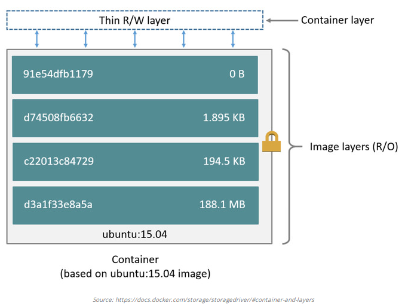
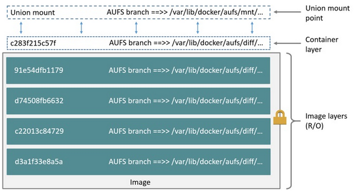

### 1.Giới thiệu

- Có lẽ bạn đã và đang sử dụng docker nhưng chưa để ý hay tìm hiểu về việc các images, containers được lưu trữ như thế nào? Hay là việc images đã được container sử dụng như thế nào? Để thực hiện những việc trên Docker sử dụng 1 thành phần có tên là Storage drivers.

### Image và layers

- Mỗi Docker images được tạo thành từ một loạt các layers. Mỗi layers sẽ đại diện cho một chỉ thị trong dockerfile. Ví dụ một Dockerfile như dưới:

  ```
  FROM ubuntu:15.04
  COPY . /app
  RUN make /app
  CMD python /app/app.py
  ```

- Docker file bên trên bao gồm 4 commands và mỗi command này sẽ tạo ra một layer. Mỗi một layer chỉ là một phần khác biệt so với layer phía trước nó. Mỗi layer sẽ được xếp lên trên layer trước nó. Điều quan trong ở đây bạn cần nhớ đó là khi mà bạn tạo một container mới thì bạn đã tạo ra một "writeable layer on top of the underlying layers" - một layer có thể ghi được đặt trên cùng so với những layer thuộc images mà container này được tạo ra. Hãy nhìn vào hình bên dưới để trực quan nhất:

  
  
#### Container và layers
  
  

- Điểm khác biệt lớn giữa một container và image đó chính là writeable layer ở trên cùng này. Tất cả những thay đổi mà bạn thực hiện bên trong container sẽ được lưu lại và layer có thể ghi này. Khi container bị xóa chúng cũng bị xóa theo và quay trở lại trạng thái unchanged (chính là bản mới sau khi vừa được build ra từ image). Nhiều container có thể truy cập vào cùng một image nếu chúng được tạo ra từ image này và tất nhiên mỗi container sẽ có một layer để lưu trạng thái của riêng nó.

- -> Docker sử dụng storage drivers để quản lí nội dung của image layers và writable container layer. Mỗi loại storage driver(aufs, overlayfs, devicemapper, Btrfs...) sẽ xử lí việc này theo các cách khác nhau, nhưng tất cả chúng đều sử dụng kiểu xếp chồng các image layers và chiến lược copy-on-write(CoW).

#### Copy-on-write (CoW) là gì 

- Copy-on-write là một chiến lược chia sẻ và sao chép các file để đạt hiệu quả tối đa. Nếu một file hoặc thư mục tồn tại ở layer thấp hơn của image và một layer khác cần truy cập vào file hay thư mục đó, thì nó chỉ sử dụng file hiện có.

- Lần đầu tiên một layer khác cần sửa đổi file (khi xây dựng image hoặc chạy container), file được sao chép vào layer đó và sửa đổi. Hiệu quả của việc này là giảm thiểu I/O và kích thước của mỗi layer tiếp theo. 

### 2. Một số loại storge driver

### 2.1. AUFS

- `AUFS` là 1 `union filesystem` (UFS). Trước đây, default storage driver sử dụng để quản lý images và các layers trong Docker trên Ubuntu, Debian là `aufs`. Nếu Linux kernel từ phiên bản 4.0 trở lên và bạn sử dụng bản Docker CE, thì storage driver được ưu tiên sử dụng là `overlay2`, nó có những cải thiện về mặt hiệu năng so với `aufs`.

- Điều kiện yêu cầu để sử dụng `aufs`:

	* Với phiên bản Docker CE, `aufs` hỗ trợ trên Ubuntu và Debian

	* Với phiên bản Docker EE, `aufs` chỉ hỗ trợ trên Ubuntu.
	
	* Nếu sử dụng Ubuntu, bạn cần phải cài thêm các packages (https://docs.docker.com/v17.12/install/linux/ubuntu/#recommended-extra-packages-for-trusty-1404) bổ sung để add thêm module `aufs` vào kernel. Nếu không cài các packages này, bạn sẽ phải sử dụng `devicemapper` trên Ubuntu 14.04 ( không được khuyến nghị sử dụng), hoặc `overlay2` ở trong phiên bản Ubuntu 16.04 và cao hơn.
	
#### Configure Docker with the aufs storage driver

- Check kernel có hỗ trợ `aufs`

  ```
  grep aufs /proc/filesystems

  nodev   aufs
  ```

- Check storage driver Docker đang sử dụng:

  ```
  docker info

  <truncated output>
  Storage Driver: aufs
  Root Dir: /var/lib/docker/aufs
  Backing Filesystem: extfs
  Dirs: 0
  Dirperm1 Supported: true
  <truncated output>
  ```

#### `aufs` storage driver làm việc như nào ?

- `aufs` là 1 `union filesystem`, cơ bản trong docker image thì UFS sẽ gộp file và thư mục trên các layer lại, hiển thị ra bên ngoài không phải là từng layer mà là một thể thống nhất.

- Hình vẽ sau mô tả container được tạo từ image `ubuntu:latest`

  

- Mỗi image layer, và container layer được biểu diễn ở trên Docker host như 1 thư mục con và được lưu ở `/var/lib/docker/aufs/`.

	* `diff/`: Chứa nội dung của mỗi layer, và mỗi layer này sẽ được lưu ở mỗi thư mục khác nhau.
	
	* `layers/`: Là nơi lưu trữ việc các image layers được xếp chồng lên nhau như nào. Đây là thư mục chứa các file, một file tương ứng với 1 image layer hoặc 1 container layer trên Docker host. Mỗi file này chứa tất cả các ID của các layer xếp dưới nó.
	
	* `mnt/`: Mount points

#### Việc Container đọc và ghi với `aufs` như nào:

- Đọc files:
	
	* File không tồn tại trên `container layer`: Nếu 1 container mở file để đọc và file đó không tồn tại trên `container layer`, storage driver sẽ tìm kiếm file trong các layer của image, bắt đầu với layer ngay bên dưới `container layer`. Nó sẽ được đọc ở layer đầu tiên tìm thấy file đó.
	
	* File tồn tại trên `container layer`: Nếu file đó đã tồn tại trên `layer container`, nó sẽ được đọc từ ngay layer này.
	
	* File tồn tại ở trên `container layer` và cả `images layer`. Nếu 1 container mở file để truy cập đọc và file đó tồn tại trên `container layer` và 1 hoặc nhiều `image layer`, thì file sẽ được đọc từ `container layer`. Các file trên `container layer` sẽ che khuất các files có cùng tên trên các `image layers`.
	
- Thay đổi file hoặc thư mục:	

	* Ghi file ở lần đầu tiên: `aufs` driver thực hiện hành động `copy_up`. Nghĩa là nó sẽ copy file từ `image layer` tới writable `container layer`. Container sẽ thực hiện ghi các thay đổi vào file này ở trên `container layer`.
	
	* Tuy nhiên, AUFS làm việc theo cơ chế `file level`. Nghĩa là, Ngay cả khi file rất lớn và chỉ 1 phần nhỏ của file được thay đổi, thì hành động `copy_up` sẽ copy toàn bộ file. Điều này có thể có ảnh hưởng đáng kể đến hiệu suất ghi container. `aufs` có thể chịu độ trễ đáng kể khi tìm kiếm file trong image có nhiều layer. Tuy nhiên, điều đáng chú ý là thao tác `copy_up` chỉ xảy ra lần đầu tiên khi 1 file được ghi vào.
	
- Xóa file và thư mục:

	* Khi xóa 1 file trong container, 1 `whiteout file` sẽ được tạo ra ở trên `container layer`. Chú ý, phiên bản của file này ở `image layer` sẽ không bị xóa ( image layers là read-only ). `Whiteout file` sẽ ngăn không cho container thao tác với file mà đã xóa.
	
	* Khi xóa 1 thư mục trong container, `opaque file` sẽ được tạo ra ở trên `container layer`. Cơ chế làm việc của nó giống với `whiteout file`, ngăn không cho truy cập sử dụng thư mục này. Giống như file, thư mục này ở trên `image layer` không bị xóa.
	
#### `aufs` và hiệu năng của Docker

- `aufs` storage driver hiệu năng kém hơn so với `overlay2` driver, nhưng nó là 1 lựa chọn tốt cho trường hợp có nhiều container khác nhau trên Docker host. Bởi vì `aufs` chia sẻ hiệu quả giữa `images` và nhiều container đang chạy, nó cho phép thời gian start container nhanh và sử dụng tối thiểu phân vùng ổ đĩa của host.

- Cơ chế về cách mà `aufs` chia sẻ image layers và containers là sử dụng `page cache` một cách rất hiệu quả.

- `aufs` có thể ảnh hưởng đáng kể về hiệu năng ghi của container. Điều này là do lần đầu tiên 1 container ghi vào bất kì file nào, file đó cần được định vị và sao chép vào `writable layer` của containers. Các độ trễ này sẽ lớn khi mà các file này tồn tại ở nhiều layer bên dưới và bản thân của các file này lớn.

### 2.2. OverlayFS ( overlay/overlay2 )

- OverlayFS là 1 `union filesystem` tương tự như AUFS, nhưng nhanh hơn và với cách thực hiện đơn giản hơn.

- Nếu bạn sử dụng OverlayFS, sử dụng `overlay2` driver sẽ tối ưu hơn `overlay` driver, bởi vì nó hiệu quả hơn về mặt sử dụng số inode của host. 

- Đối với ubuntu sử dụng kernel 4.0 trở lên, hoặc RHEL/CentOS sử dụng version 3.10.0-514 trở lên thì storage driver mặc định được sử dụng là `overlay2`.

- `overlay` và `overlay2` drivers hỗ trợ cả `xfs` backing filesystems, nhưng chỉ với `d_type=true` được enabled.

### Cấu hình Docker sử dụng `overlay` hoặc `overlay2` storage driver.

- Khuyến nghị nên sử dụng `overlay2` driver nếu có thể, sẽ tối ưu hơn `overlay` driver.

- Nếu bạn muốn sử dụng `overlay` driver thay thế `overlay2` driver, các bước cần thưc hiện:

	* Stop Docker
	
	```
	systemctl stop docker
	```
	
	* Sửa hoặc tạo mới file /etc/docker/daemon.json với nội dung sau:
	
	```
	{
      "storage-driver": "overlay"
    }
	```
	
	* Start Docker
	
	```
	systemctl start docker
	```

### Chú ý khi thay đổi storage driver

- Nếu thay đổi storage driver ở Docker host đang chạy, thì các images và containers sẽ không tồn tại khi restart lại Docker. Bởi vì, mỗi loại storage driver có cấu trúc thư mục lưu trữ khác nhau trên Docker host.

- Nếu bạn cần thay đổi storage driver, bạn cần lưu lại các images với `docker save`, push các image này lên repo, sau khi thay đổi storage driver, bạn cần pull lại các image này và restart containers.

### 3. Tham khảo:

- https://docs.docker.com/storage/storagedriver/
- https://docs.docker.com/storage/storagedriver/aufs-driver/
- https://docs.docker.com/storage/storagedriver/overlayfs-driver/