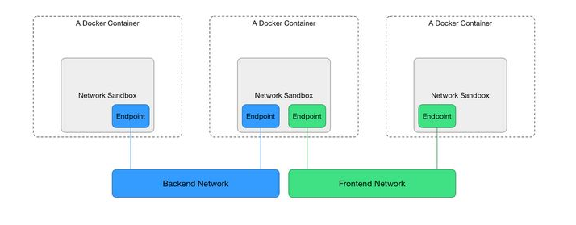

### 1. Giới thiệu

 

- Để thực hiện quản lý phần network của container, Docker-server sử dụng thành phần `networking`. Trong phần này mình sẽ giới thiệu về các thành phần của `networking`.

 

- `Sandbox` chứa các cấu hình mạng của container. Bao gồm quản lý interfaces, routing table, DNS. 1 `Sandbox` có thể chứa nhiều `endpoints` từ nhiều mạng khác nhau.

- `Endpoint`: để kết nối 1 sandbox tới 1 mạng. 

- `Network driver`: được sử dụng bởi docker engine để kết nối container vào hạ tầng network thực tế. Có hai loại network driver là native và remote. Native driver có mặt bên trong Docker Engine và các remote driver được duy trì và phát triển bởi cộng đồng và các vendor.

### 2. Các loại native network drivers 

#### 2.1. Bridge network

- Nếu bạn không chỉ định driver, thì đây là kiểu network được sử dụng mặc định. `Bridge networks` thường được sử dụng khi ứng dụng chạy trong các containers độc lập. Docker sẽ tạo ra một switch ảo. Khi container được tạo ra, interface của container sẽ gắn vào switch ảo này và kết nối với interface của host.
	
- `Default bridge`:

  ```
  root@docker2:~# docker network inspect bridge
  [
    {
        "Name": "bridge",
        "Id": "61de4bb982b4b251934792984569399eeb2f064514dfb935c45981e36ee55423",
        "Created": "2019-03-27T02:29:01.092149759Z",
        "Scope": "local",
        "Driver": "bridge",
        "EnableIPv6": false,
        "IPAM": {
            "Driver": "default",
            "Options": null,
            "Config": [
                {
                    "Subnet": "172.17.0.0/16",
                    "Gateway": "172.17.0.1"
                }
            ]
        },
        "Internal": false,
        "Attachable": false,
        "Ingress": false,
        "ConfigFrom": {
            "Network": ""
        },
        "ConfigOnly": false,
        "Containers": {},
        "Options": {
            "com.docker.network.bridge.default_bridge": "true",
            "com.docker.network.bridge.enable_icc": "true",
            "com.docker.network.bridge.enable_ip_masquerade": "true",
            "com.docker.network.bridge.host_binding_ipv4": "0.0.0.0",
            "com.docker.network.bridge.name": "docker0",
            "com.docker.network.driver.mtu": "1500"
        },
        "Labels": {}
    }
  ]
  ```
  
- Mặc định với `default bridge`, các container chỉ có thể kết nối với nhau thông qua ip, Tuy nhiên, các container được cấp ip động nên nó có thể thay đổi, dẫn đến nhiều khó khăn. Vì vậy, thay vì dùng địa chỉ ip, ta có thể dùng name của các container để "liên lạc" giữa các container với nhau.

- Để các container "liên lạc" với nhau thông qua `name`, cần thực hiện link giữa các container với nhau bằng cách sử dụng option `--link`.

### User-defined bridges

- Bạn có thể tự định nghĩa 1 network bridges riêng. Đối với `User-defined bridges`, các container sẽ kết nối với nhau thông qua `name` mà không phải sử dụng option `--link`.

- Tạo 1 user-defined bridge network.

  ```
  docker network create -d bridge my-net
  ```
  
- Check network vừa tạo:

  ```
  docker network ls
  NETWORK ID          NAME                DRIVER              SCOPE
  61de4bb982b4        bridge              bridge              local
  49910820e5a6        host                host                local
  303facf55290        my-net              bridge              local
  ```
- Tạo 2 container sử dụng user-defined bridge 

  ```
  docker run -d --name my-nginx1 \
  --network my-net \
  nginx_image
  
  docker run -d --name my-nginx2 \
  --network my-net \
  nginx_image
  ```
- Thực hiện truy cập vào container 1 để check kết nối giữa 2 container sử dụng name:

  ```
  root@docker2:~# docker exec -it my-nginx1 /bin/bash
  root@26ca74f203b1:/etc/nginx# ping my-nginx2
  ping my-nginx2 -c 3
  PING my-nginx2 (172.20.0.3) 56(84) bytes of data.
  64 bytes from my-nginx2.my-net (172.20.0.3): icmp_seq=1 ttl=64 time=0.167 ms
  64 bytes from my-nginx2.my-net (172.20.0.3): icmp_seq=2 ttl=64 time=0.160 ms
  64 bytes from my-nginx2.my-net (172.20.0.3): icmp_seq=3 ttl=64 time=0.153 ms
  ```
  
#### 2.2. Host network

- Containers sẽ dùng mạng trực tiếp của máy host. Network configuration bên trong container đồng nhất với host.

### 2.3. None network
  
- Các container thiết lập network này sẽ không được cấu hình mạng.  

### 2.4. Macvlan 

- Macvlan cho phép cấu hình sub-interfaces (hay còn gọi là slave devices) trên một Ethernet interface vật lý (còn gọi là upper device), mỗi sub-interfaces này có địa chỉ MAC riêng và do đó có địa chỉ IP riêng. Các ứng dụng, VM và các containers có thể kết nối với một sub-interface nhất định để kết nối trực tiếp với mạng vật lý, sử dụng địa chỉ MAC và địa chỉ IP riêng của chúng.

### 2.5. Overlay network

- Overlay network là mạng có thể kết nối nhiều container trên các Docker Engine lại với nhau, trong môi trường cluster.
    
- Swarm tạo ra overlay network chỉ available với các nodes bên trong swarm. Khi bạn tạo ra một service sử dụng overlay network, manager node sẽ tự động kế thừa overlay network tới các nodes chạy các service tasks.

- Overlay network trong swarm sử dụng công nghệ vxlan.

- Khi bạn khởi tạo 1 swarm hoặc join 1 Docker host vào cụm swarm đã tồn tại, thì có 2 networks mới được tạo ra trên Docker host:
	
	* overlay network gọi là `ingress`, xử lý lưu lượng kiểm soát và lưu lượng dữ liệu liên quan đến các swarm services. Khi bạn tạo 1 swarm service và không kết nối service đó tới 1 `user-defined overlay network` nào, thì mặc định nó sẽ kết nối tới ingress network. 
	
	* bridge network gọi là `docker_gwbridge`, để kết nối các Docker daemon ( Docker host) tới các Docker daemon khác trong cụm swarm.
	
- Bạn có thể sử dụng lệnh `docker network create` để tự tạo `user-defined overlay` network.
  
  ```
  docker network create -d overlay test-overlay
  ```
  
- Chú ý khi tạo 1 `overlay network`, nếu các Docker daemon enable firewall, bạn cần allow các port sau:

	* TCP port 2377 for cluster management communications
	
    * TCP and UDP port 7946 for communication among nodes
    
	* UDP port 4789 for overlay network traffic
	
### Lab overlay network:

- Mô hình: 1 cụm swarm với 2 Docker host.
	
	* Node manager: 10.1.38.54/24

	* Node worker: 10.1.38.15

- Khởi tạo 1 swarm trên Node manager: 

  ```
  docker swarm init --advertise-addr 10.1.38.54
  ``` 
 
- Join node worker vào swarm, thực hiện trên node worker:

  ```
  docker swarm join --token SWMTKN-1-5j5bqtryvu1un4q5jb0zilu1l57fs3z1juozgdz5q83ibczlog-4mbub7e8i7vdmjisqvl33neln 10.1.38.54:2377
  ```
- Check network sau khi khởi tạo cụm swarm trên, ta thấy 2 networks mới được tạo ra trên Docker host là ingress và docker_gwbridge.

  ```
  docker network ls
  
  NETWORK ID          NAME                DRIVER              SCOPE
  d4cda439c9e6        bridge              bridge              local
  46bd65e3aeb8        docker_gwbridge     bridge              local
  b2b9746262fb        host                host                local
  tqygtjksax9f        ingress             overlay             swarm
  f693557d15d7        none                null                local
  ```
- Create an nginx service and extend the my-multi-host-network to nodes where

  ```
  # the service's tasks run.
  $ $ docker service create --replicas 2 --network my-multi-host-network --name my-web nginx

  716thylsndqma81j6kkkb5aus
  ```
- Tham khảo:
	
	* https://docs.docker.com/network/
	
	* https://github.com/hocchudong/ghichep-docker/blob/master/docs/docker-coban/docker-network.md